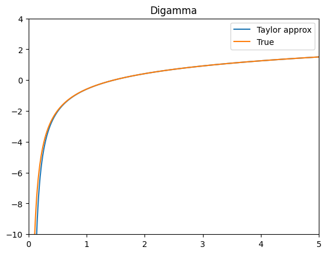
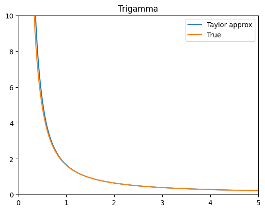
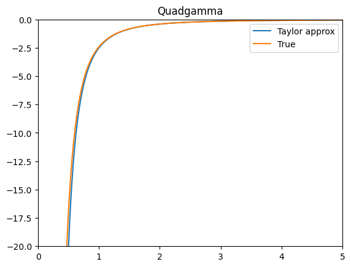
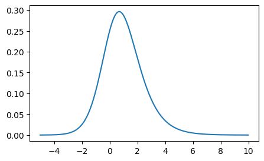
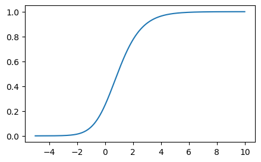
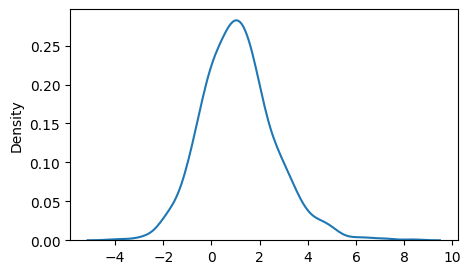

```python
# install the library using the following code.
%pip install --force-reinstall https://github.com/SeewooLi/sldensity.git#egg=sldensity
```


```python
import sldensity as sl
import pandas as pd
import numpy as np
pd.plotting.register_matplotlib_converters()
import matplotlib.pyplot as plt
%matplotlib inline
import seaborn as sns
```

# PRHL (proportional reversed hazard logistic) distribution

$$
f(X)=\frac{\alpha e^{-x}}{\left\lbrace1+e^{-x}\right\rbrace^{\alpha+1}}
$$

$$
F(X)=\left\lbrace1+e^{-x}\right\rbrace^{-\alpha}
$$

$$
f(X;\alpha,\mu,\lambda)=\frac{\alpha \lambda e^{-\lambda (x-\mu)}}{\left\lbrace1+e^{-\lambda (x-\mu)}\right\rbrace^{\alpha+1}}
$$

$$
F(X;\alpha,\mu,\lambda)=\left\lbrace1+e^{-\lambda (x-\mu)}\right\rbrace^{-\alpha}
$$

## **Digamma and poly-gamma functions**

$$
\begin{align}
\psi(x)&=\frac{d}{dx}\log{\Gamma(x)}   \\
&=\frac{\Gamma'(x)}{\Gamma(x)}   \\
&\approx\log{x}-\sum_{k=1}^{\infty}\frac{B_k}{kz^k}   \\
&\approx\log{x}-\frac{1}{2x}-\frac{1}{12x^2}+\cdots    \\
\end{align}
$$


$$
\psi^{(n)}(x)=\frac{d^n}{dx^n}\psi(x)\\ 
$$

$$
\begin{align}
\psi'(x)&=\frac{d}{dx}\psi(x)    \\
&=\frac{\Gamma''(x)}{\Gamma(x)}-\left\lbrace\psi(x)\right\rbrace^2    \\
&\approx\sum_{k=0}^{\infty}\frac{B_k}{z^{k+1}}    \\
&\approx\frac{1}{z}+\frac{1}{2z^2}+\frac{1}{6z^3}+\cdots
\end{align}
$$
   
and

$$
\begin{align}
\psi''(x)&=\frac{d}{dx}\psi'(x)    \\
&=\frac{d}{dx}\left[\frac{\Gamma''(x)}{\Gamma(x)}-\left\lbrace\psi(x)\right\rbrace^2\right]    \\
&=\frac{\Gamma^{(3)}(x)}{\Gamma(x)}-3\psi'(x)\psi(x)-\left\lbrace\psi(x)\right\rbrace^3    \\
&\approx-\sum_{k=0}^{\infty}(k+1)\frac{B_k}{z^{k+2}}    \\
&\approx-\frac{1}{z^2}-\frac{1}{z^3}-\frac{1}{2z^4}+\cdots
\end{align}
$$


```python
xxx=np.arange(0.001,5,0.001)
plot = sns.lineplot(
    x=xxx,
    y=np.log(xxx)-1/(2*xxx)-1/(12*xxx**2),
    label='Taylor approx'
)
plot = sns.lineplot(
    x=xxx,
    y=gms.digamma(xxx),
    label='True'
)
plot.set(title='Digamma',
         ylim=(-10,4),
        xlim=(0,5))
```


    [Text(0.5, 1.0, 'Digamma'), (-10.0, 4.0), (0.0, 5.0)]


    

    


```python
xxx=np.arange(0.001,5,0.001)
plot = sns.lineplot(
    x=xxx,
    y=1/xxx+1/(2*xxx**2)+1/(6*xxx**3),
    label='Taylor approx'
)
plot = sns.lineplot(
    x=xxx,
    y=gms.polygamma(1,np.arange(0.001,5,0.001)),
    label='True'
)
plot.set(title='Trigamma',
         ylim=(0,10),
        xlim=(0,5))
```


    [Text(0.5, 1.0, 'Trigamma'), (0.0, 10.0), (0.0, 5.0)]


    

    


```python
xxx=np.arange(0.001,5,0.001)
plot = sns.lineplot(
    x=xxx,
    y=-1/(xxx**2)-1/(xxx**3)-1/(2*xxx**4),
    label='Taylor approx'
)
plot = sns.lineplot(
    x=xxx,
    y=gms.polygamma(2,np.arange(0.001,5,0.001)),
    label='True'
)
plot.set(title='Quadgamma',
         ylim=(-20,0),
        xlim=(0,5))
```


    [Text(0.5, 1.0, 'Quadgamma'), (-20.0, 0.0), (0.0, 5.0)]


    

    


## Mean and Variance of PRHL

### **MGF**

$$
\begin{align}
M_x(t)&=E(e^{tx})=\int_{-\infty}^{\infty}e^{tx}\frac{\alpha \lambda e^{-\lambda (x-\mu)}}{\left\lbrace1+e^{-\lambda (x-\mu)}\right\rbrace^{\alpha+1}}\,dx    \\
&=e^{t\mu}\frac{\Gamma\left\lbrace1-\frac{t}{\lambda}\right\rbrace\Gamma\left\lbrace\alpha+\frac{t}{\lambda}\right\rbrace}{\Gamma(\alpha)}
\end{align}
$$

Let, $u=\left\lbrace1+e^{-\lambda (x-\mu)}\right\rbrace^{-1}$.

Then, $\frac{du}{dx}=\frac{\lambda e^{-\lambda (x-\mu)}}{\left\lbrace1+e^{-\lambda (x-\mu)}\right\rbrace^{2}}$,

and

$$
\begin{align}
\frac{1-u}{u}&=e^{\lambda(x-\mu)}    \\
e^{-\lambda\mu}\left\lbrace\frac{1-u}{u}\right\rbrace&=e^{-\lambda x}    \\
\left[e^{-\lambda\mu}\left\lbrace\frac{1-u}{u}\right\rbrace\right]^{-\frac{t}{\lambda}}&=e^{tx}
\end{align}
$$

Therefore,

$$
\begin{align}
M_x(t)&=E(e^{tx})=\int_{0}^{1}\left[e^{-\lambda\mu}\left\lbrace\frac{1-u}{u}\right\rbrace\right]^{-\frac{t}{\lambda}}\frac{\alpha}{\left\lbrace1+e^{-\lambda (x-\mu)}\right\rbrace^{\alpha-1}}\,du    \\
&=\int_{0}^{1}\left[e^{-\lambda\mu}\left\lbrace\frac{1-u}{u}\right\rbrace\right]^{-\frac{t}{\lambda}}\alpha u^{\alpha-1}\,du    \\
&=\alpha e^{t\mu}\int_{0}^{1}(1-u)^{-\frac{t}{\lambda}}u^{\frac{t}{\lambda}} u^{\alpha-1}\,du    \\
&=\alpha e^{t\mu}\int_{0}^{1}(1-u)^{-\frac{t}{\lambda}}u^{\alpha+\frac{t}{\lambda}-1}\,du    \\
&=\alpha e^{t\mu} Beta\left\lbrace1-\frac{t}{\lambda},\, \alpha+\frac{t}{\lambda}\right\rbrace      \\
&=\alpha e^{t\mu}\frac{\Gamma\left\lbrace1-\frac{t}{\lambda}\right\rbrace\Gamma\left\lbrace\alpha+\frac{t}{\lambda}\right\rbrace}{\Gamma(\alpha+1)}    \\
&=e^{t\mu}\frac{\Gamma\left\lbrace1-\frac{t}{\lambda}\right\rbrace\Gamma\left\lbrace\alpha+\frac{t}{\lambda}\right\rbrace}{\Gamma(\alpha)}
\end{align}
$$

### **Moments**

$$
\begin{align}
M'_x(t)&=\mu M_x(t)+e^{t\mu}\left[\frac{\Gamma'\left\lbrace\alpha+\frac{t}{\lambda}\right\rbrace\Gamma\left\lbrace1-\frac{t}{\lambda}\right\rbrace}{\lambda\Gamma\left\lbrace\alpha\right\rbrace}-\frac{\Gamma\left\lbrace\alpha+\frac{t}{\lambda}\right\rbrace\Gamma'\left\lbrace1-\frac{t}{\lambda}\right\rbrace}{\lambda\Gamma\left\lbrace\alpha\right\rbrace}\right]
\end{align}    
$$


$$
\begin{align}
M''_x(t)&=\mu M'_x(t)    \\
&\qquad +\mu e^{t\mu}\left[\frac{\Gamma'\left\lbrace\alpha+\frac{t}{\lambda}\right\rbrace\Gamma\left\lbrace1-\frac{t}{\lambda}\right\rbrace}{\lambda\Gamma\left\lbrace\alpha\right\rbrace}-\frac{\Gamma\left\lbrace\alpha+\frac{t}{\lambda}\right\rbrace\Gamma'\left\lbrace1-\frac{t}{\lambda}\right\rbrace}{\lambda\Gamma\left\lbrace\alpha\right\rbrace}\right]    \\
&\qquad +e^{t\mu}\left[\frac{\Gamma''\left\lbrace\alpha+\frac{t}{\lambda}\right\rbrace\Gamma\left\lbrace1-\frac{t}{\lambda}\right\rbrace-\Gamma'\left\lbrace\alpha+\frac{t}{\lambda}\right\rbrace\Gamma'\left\lbrace1-\frac{t}{\lambda}\right\rbrace}{\lambda^2\Gamma\left\lbrace\alpha\right\rbrace}
-\frac{\Gamma'\left\lbrace\alpha+\frac{t}{\lambda}\right\rbrace\Gamma'\left\lbrace1-\frac{t}{\lambda}\right\rbrace-\Gamma\left\lbrace\alpha+\frac{t}{\lambda}\right\rbrace\Gamma''\left\lbrace1-\frac{t}{\lambda}\right\rbrace}{\lambda^2\Gamma\left\lbrace\alpha\right\rbrace}\right]
\end{align}
$$

and

$$
\begin{align}
M^{(3)}_x(t)&=\mu M''_x(t)    \\
&\qquad +\mu^2 e^{t\mu}\left[\frac{\Gamma'\left\lbrace\alpha+\frac{t}{\lambda}\right\rbrace\Gamma\left\lbrace1-\frac{t}{\lambda}\right\rbrace}{\lambda\Gamma\left\lbrace\alpha\right\rbrace}-\frac{\Gamma\left\lbrace\alpha+\frac{t}{\lambda}\right\rbrace\Gamma'\left\lbrace1-\frac{t}{\lambda}\right\rbrace}{\lambda\Gamma\left\lbrace\alpha\right\rbrace}\right]   \\ 
&\qquad +2\mu e^{t\mu}\left[\frac{\Gamma''\left\lbrace\alpha+\frac{t}{\lambda}\right\rbrace\Gamma\left\lbrace1-\frac{t}{\lambda}\right\rbrace-\Gamma'\left\lbrace\alpha+\frac{t}{\lambda}\right\rbrace\Gamma'\left\lbrace1-\frac{t}{\lambda}\right\rbrace}{\lambda^2\Gamma\left\lbrace\alpha\right\rbrace}
-\frac{\Gamma'\left\lbrace\alpha+\frac{t}{\lambda}\right\rbrace\Gamma'\left\lbrace1-\frac{t}{\lambda}\right\rbrace-\Gamma\left\lbrace\alpha+\frac{t}{\lambda}\right\rbrace\Gamma''\left\lbrace1-\frac{t}{\lambda}\right\rbrace}{\lambda^2\Gamma\left\lbrace\alpha\right\rbrace}\right]    \\
&\qquad +e^{t\mu}\left[\frac{\Gamma^{(3)}\left\lbrace\alpha+\frac{t}{\lambda}\right\rbrace\Gamma\left\lbrace1-\frac{t}{\lambda}\right\rbrace-3\Gamma''\left\lbrace\alpha+\frac{t}{\lambda}\right\rbrace\Gamma'\left\lbrace1-\frac{t}{\lambda}\right\rbrace}{\lambda^3 \Gamma(\alpha)}
+\frac{+3\Gamma'\left\lbrace\alpha+\frac{t}{\lambda}\right\rbrace\Gamma''\left\lbrace1-\frac{t}{\lambda}\right\rbrace-\Gamma\left\lbrace\alpha+\frac{t}{\lambda}\right\rbrace\Gamma^{(3)}\left\lbrace1-\frac{t}{\lambda}\right\rbrace}{\lambda^3 \Gamma(\alpha)}\right]
\end{align}
$$

### **Mean**

$$
\begin{align}
M'_x(0)=E(x)&=\mu M_x(0)+\frac{1}{\lambda}\left[\frac{\Gamma'(\alpha)}{\Gamma(\alpha)}-\frac{\Gamma'(1)}{\Gamma(1)}\right]    \\
&=\mu+\frac{1}{\lambda}\left[\psi(\alpha)-\psi(1)\right]     \\
&\approx\mu+\frac{1}{\lambda}\left[\log{\alpha}-\frac{1}{2\alpha}-\frac{1}{12\alpha^2}+0.57721\right]
\end{align}
$$

### $\bf{q^{\text{th}}}$ **quantile**

$$
Quantile(q)=\mu-\frac{1}{\lambda}\log{\left[q^{-\frac{1}{\alpha}}-1\right]}
$$

, where $0\le q\le1$.

### **Median**

$$
Med(x)=\mu-\frac{1}{\lambda}\log{\left[2^{\frac{1}{\alpha}}-1\right]}
$$

### **Variance**

$$
\begin{align}
M''_x(0)=E\left[x^2\right]&=\mu M'_x(0)+\frac{\mu}{\lambda} \left[\frac{\Gamma'(\alpha)}{\Gamma(\alpha)}-\frac{\Gamma'(1)}{\Gamma(1)}\right]    \\
&\qquad +\frac{1}{\lambda^2 \Gamma(\alpha)}\left[\Gamma''(\alpha)\Gamma(1)-2\Gamma'(\alpha)\Gamma'(1)+\Gamma(\alpha)\Gamma''(1)\right]    \\
&=\mu M'_x(0)+\frac{\mu}{\lambda}\left[\frac{\Gamma'(\alpha)}{\Gamma(\alpha)}-\frac{\Gamma'(1)}{\Gamma(1)}\right]    \\
&\qquad +\frac{1}{\lambda^2}\left[\frac{\Gamma''(\alpha)}{\Gamma(\alpha)}-\left\lbrace\frac{\Gamma'(\alpha)}{\Gamma(\alpha)}\right\rbrace^2+\frac{\Gamma''(1)}{\Gamma(1)}-\left\lbrace\frac{\Gamma'(1)}{\Gamma(1)}\right\rbrace^2\right]    \\
&\qquad +\frac{1}{\lambda^2}\left[\left\lbrace\frac{\Gamma'(\alpha)}{\Gamma(\alpha)}\right\rbrace^2-2\frac{\Gamma'(\alpha)}{\Gamma(\alpha)}\frac{\Gamma'(1)}{\Gamma(1)}+\left\lbrace\frac{\Gamma'(1)}{\Gamma(1)}\right\rbrace^2\right]    \\
&=\mu^2+2\frac{\mu}{\lambda}\left[\psi(\alpha)-\psi(1)\right]    \\
&\qquad +\frac{1}{\lambda^2}\left[\psi'(\alpha)+\psi'(1)\right]    \\
&\qquad +\frac{1}{\lambda^2}\left[\psi(\alpha)-\psi(1)\right]^2
\end{align}
$$

> Meanwhile, $\left[E(x)\right]^2$ is,

$$
\begin{align}
\left[E(x)\right]^2&=\left[M'_x(x)\right]^2    \\
&= \mu^2+2\frac{\mu}{\lambda}\left[\psi(\alpha)-\psi(1)\right]+\frac{1}{\lambda^2}\left[\psi(\alpha)-\psi(1)\right]^2
\end{align}
$$


Using $M''_x(0)$ and $\left[M'_x(x)\right]^2$,

$$
\begin{align}
\therefore Var(x) &=E\left\lbrace x^2\right\rbrace-\left[E(x)\right]^2    \\
&= M''_x(0)-\left[M'_x(x)\right]^2    \\
&=\frac{1}{\lambda^2}\left[\psi'(\alpha)+\psi'(1)\right]    \\
&\approx\frac{1}{\lambda^2}\left[\frac{1}{\alpha}+\frac{1}{2\alpha^2}+\frac{1}{6\alpha^3}+1.64493407\right]
\end{align}
$$


### **Skewness**

$$
\begin{align}
M^{(3)}_x(0)=E\left\lbracex^3\right\rbrace  &=\mu M''_x(0)+\frac{\mu^2}{\lambda}\left[\psi(\alpha)-\psi(1)\right]    \\
&\qquad +\frac{2\mu}{\lambda^2}\left[\left[\psi'(\alpha)+\psi'(1)\right]+\left[\psi(\alpha)-\psi(1)\right]^2\right]    \\
&\qquad +\frac{1}{\lambda^3}\left[\frac{\Gamma^{(3)}(\alpha)}{\Gamma(\alpha)}-\frac{\Gamma^{(3)}(1)}{\Gamma(1)}\right]    \\
&\qquad -\frac{1}{\lambda^3}\left[3\psi'(\alpha)\psi(1)-3\psi(\alpha)\psi'(1)\right]    \\
&\qquad -\frac{1}{\lambda^3}\left[3\psi(\alpha)^2\psi(1)-3\psi(\alpha)\psi(1)^2\right]    \\
&=\mu^3+\frac{3\mu^2}{\lambda}\left[\psi(\alpha)-\psi(1)\right]    \\
&\qquad +\frac{3\mu}{\lambda^2}\left[\left[\psi'(\alpha)+\psi'(1)\right]+\left[\psi(\alpha)-\psi(1)\right]^2\right]    \\
&\qquad +\frac{1}{\lambda^3}\left[\frac{\Gamma^{(3)}(\alpha)}{\Gamma(\alpha)}-\frac{\Gamma^{(3)}(1)}{\Gamma(1)}\right]    \\
&\qquad -\frac{1}{\lambda^3}\left[3\psi'(\alpha)\psi(1)-3\psi(\alpha)\psi'(1)\right]    \\
&\qquad -\frac{1}{\lambda^3}\left[3\psi(\alpha)^2\psi(1)-3\psi(\alpha)\psi(1)^2\right]
\end{align}
$$

> Meanwhile, $\left[E(x)\right]^3$ is,

$$
\begin{align}
\left[E(x)\right]^2&=\left[M'_x(x)\right]^3    \\
&=\mu^3+\frac{3\mu^2}{\lambda}\left[\psi(\alpha)-\psi(1)\right]    \\
&\qquad +\frac{3\mu}{\lambda^2}\left[\psi(\alpha)-\psi(1)\right]^2 + \frac{1}{\lambda^3}\left[\psi(\alpha)-\psi(1)\right]^3    \\
\end{align}      
$$

, and $3E(x)Var(x)$ is,

$$
\begin{align}
3E(x)Var(x)&=\frac{3\mu}{\lambda^2}\left[\psi'(\alpha)+\psi'(1)\right]    \\
&\qquad +\frac{3}{\lambda^3}\left[\psi'(\alpha)+\psi'(1)\right]\left[\psi(\alpha)-\psi(1)\right]
\end{align}
$$

$$
\begin{align}
Var(x)^{\frac{3}{2}}Skew(x)&=E\left[\left\lbracex-E(x)\right\rbrace^3\right]=E\left\lbracex^3\right\rbrace-3E(x)Var(x)-E(x)^3    \\
&=M^{(3)}_x(0)-3Mean(x)Var(x)-Mean(x)^3    \\
&=\frac{1}{\lambda^3}\left[\frac{\Gamma^{(3)}(\alpha)}{\Gamma(\alpha)}-\frac{\Gamma^{(3)}(1)}{\Gamma(1)}\right]    \\
&\qquad -\frac{1}{\lambda^3}\left[3\psi'(\alpha)\psi(1)-3\psi(\alpha)\psi'(1)\right]    \\
&\qquad -\frac{1}{\lambda^3}\left[3\psi(\alpha)^2\psi(1)-3\psi(\alpha)\psi(1)^2\right]    \\  
&\qquad -\frac{1}{\lambda^3}\left[\psi(\alpha)-\psi(1)\right]^3-\frac{3}{\lambda^3}\left[\psi'(\alpha)+\psi'(1)\right]\left[\psi(\alpha)-\psi(1)\right]    \\
&=\frac{1}{\lambda^3}\left[\frac{\Gamma^{(3)}(\alpha)}{\Gamma(\alpha)}-\frac{\Gamma^{(3)}(1)}{\Gamma(1)}\right]    \\
&\qquad -\frac{1}{\lambda^3}\left[\psi(\alpha)^3-\psi(1)^3\right]-\frac{3}{\lambda^3}\left[\psi'(\alpha)\psi(\alpha)-\psi'(1)\psi(1)\right]    \\
&=\frac{1}{\lambda^3}\left[\psi''(\alpha)-\psi''(1)\right]    \\
&\approx-\frac{1}{\lambda^3}\left[\frac{1}{\alpha^2}+\frac{1}{\alpha^3}+\frac{1}{2\alpha^4}-2.40411381\right]
\end{align}
$$

$$
\therefore
\begin{align}
Skew(x)&=\frac{\left[\psi''(\alpha)-\psi''(1)\right]}{\left[\psi'(\alpha)+\psi'(1)\right]^{\frac{3}{2}}}    
&\approx -\frac{\frac{1}{\alpha^2}+\frac{1}{\alpha^3}+\frac{1}{2\alpha^4}-2.40411381}{\left[\frac{1}{\alpha}+\frac{1}{2\alpha^2}+\frac{1}{6\alpha^3}+1.64493407\right]^{\frac{3}{2}}}
\end{align}
$$

# Estimation for ($\alpha$, $\mu$, $\lambda$)

Letting $\zeta$ refer to the skewness of PRHL distribution,   
the skewness parameter $\alpha$ can be estimated approximately by finding a solution of the following equation in which a numerical method (e.g., Newton-Raphson method) can be used

$$
\zeta \left[\frac{1}{\alpha}+\frac{1}{2\alpha^2}+\frac{1}{6\alpha^3}+1.64493407\right]^{\frac{3}{2}}+\frac{1}{\alpha^2}+\frac{1}{\alpha^3}+\frac{1}{2\alpha^4}-2.40411381=0,
$$

or, equivalently, without asymptotic approximation,

$$
\zeta\left[\psi'(\alpha)+\psi'(1)\right]^{\frac{3}{2}}-\left[\psi''(\alpha)-\psi''(1)\right]=0
$$


## Newton-Raphson method for the estimation of $\alpha$

* without asymtotic approximation

Let $f(\alpha)=\zeta\left[\psi'(\alpha)+\psi'(1)\right]-\left[\psi''(\alpha)-\psi''(1)\right]$.


$$
\begin{align}
f'(\alpha)&=\frac{d}{d\alpha}f(\alpha)    \\
&=\psi''(\alpha)\frac{3\zeta}{2}\left[\psi'(\alpha)+\psi'(1)\right]^{\frac{1}{2}}-\psi^{(3)}(\alpha)
\end{align}
$$

* with asymtotic approximation

Let $f(\alpha)=\zeta \left[\frac{1}{\alpha}+\frac{1}{2\alpha^2}+\frac{1}{6\alpha^3}+1.64493407\right]^{\frac{3}{2}}+\frac{1}{\alpha^2}+\frac{1}{\alpha^3}+\frac{1}{2\alpha^4}-2.40411381$.


$$
\begin{align}
f'(\alpha)&=\frac{d}{d\alpha}f(\alpha)    \\
&=-\zeta\frac{3}{2} \left\lbrace\frac{1}{\alpha}+\frac{1}{2\alpha^2}+\frac{1}{6\alpha^3}+1.64493407\right\rbrace^{\frac{1}{2}}\left\lbrace\frac{1}{\alpha^2}+\frac{1}{\alpha^3}+\frac{1}{2\alpha^4}\right\rbrace    \\
&\quad -\left\lbrace\frac{2}{\alpha^3}+\frac{3}{\alpha^4}+\frac{2}{\alpha^5}\right\rbrace
\end{align}
$$

 
* If, we are to update from $\alpha^{(t)}$ to $\alpha^{(t+1)}$,   
the following Newton-Raphson equation can be used for the updating:

$$
\alpha^{(t+1)} = \alpha^{(t)} - \frac{f(\alpha^{(t)})}{f'(\alpha^{(t)})}
$$

## Estimation of $\lambda$

$$
\hat{\lambda}=\sqrt{\frac{\psi'(\alpha)+\psi'(1)}{s^2}}
$$

, where $s^2$ is the sample variance.

## Estimation of $\mu$

$$
\hat{\mu}=\bar{x}-\frac{1}{\lambda}\left[\psi(\alpha)-\psi(1)\right]
$$

, where $\bar{x}$ is the sample mean.

---
## Arguments (common for all functions)

* Parameters
    * `a` - Parameter $\alpha$.
    * `m` - Parameter $\mu$.
    * `l` - Parameter $\lambda$.

<br>

* Data
    * `x` - `bias_idx_num`.
    * `df` - A dataframe containing `bias_idx_num` & `cell_cnt`.   

<br>

* Others
    * `n` - The number of samples to be drawn.
    * `q` - The cumulative probability (0 < $q$ < 1).

---
    

## Functions

### PRHL

* `dPRHL(x, a, m, l)` : PDF of PRHL.
    * Returns \
        `pdf` - The evaluation(s) of PDF at `x`.

<br>

* `cPRHL(x, a, m, l)` : CDF of PRHL.
    * Returns \
        `cdf` - The evaluation(s) of CDF at `x`.

<br>

* `qPRHL(q, a, m, l)` : Inverse-CDF of PRHL.
    * Returns \
        `quantile` - The $q^{\text{th}}$ quantile.

<br>

* `rPRHL(n, a, m, l)` : Random sampling from PRHL.
    * Returns \
        `samples` - Total `n` samples drawn from $PRHL(\alpha, \, \mu, \, \lambda)$.

<br>

* `estPRHL(df)` : Parameter estimation for PRHL distribution parameters (i.e., $\alpha, \, \mu, \,\text{and}\, \lambda$).
    * Returns \
        `a` - Parameter $\alpha$, \
        `m` - Parameter $\mu$, \
        `l` - Parameter $\lambda$, \
        `skew` - Skewness of the density.
        
<br>
        
* `moments_df(df)` : Mean, variance, and skewness for a dataset.
    * Returns \
        `mean` - Mean of the data, \
        `var` - Variance of the data, \
        `skew` - Skewness of the data.
    
<br>

* `moments_pdf(a, m, l)` : Mean, variance, and skewness for a $PRHL(\alpha, \, \mu, \,  \lambda)$.
    * Returns \
        `mean` - Mean of the data, \
        `var` - Variance of the data, \
        `skew` - Skewness of the data.

<br>

* `a_to_sigma(a)` : Transition of $\alpha$ to $\sigma_{section 0}$ & $\sigma_{section 1}$ for the approximation of half-Gaussian to PRHL.
    * Returns \
        `mean` - Mean of the data, \
        `var` - Variance of the data, \
        `skew` - Skewness of the data.

<br>

### MPRHL

* `dPRHLM(x, a, m, l)` : PDF of PRHL.\
    * Returens \
        `pdf` - The evaluation(s) of PDF at `x`.
        
<br>

* `estPRHLM(df, a, m, l)` : Parameter estimation for MPRHL distribution parameters (i.e., vectors of $\alpha, \, \mu, \,\text{and}\, \lambda$).
    * Returns \
        `a` - Parameter $\alpha$, \
        `m` - Parameter $\mu$, \
        `l` - Parameter $\lambda$, \
        `skew` - Skewness of the density.
        
---

## Examples


```python
x = np.arange(-5,10,0.01)
a = 2
m = 0
l = 1
df = pd.read_csv('sample1.csv', index_col=False)
df.rename(columns={"x":"x_axis"}, inplace=True)
df.head(4)
```


<div>
<style scoped>
    .dataframe tbody tr th:only-of-type {
        vertical-align: middle;
    }

    .dataframe tbody tr th {
        vertical-align: top;
    }

    .dataframe thead th {
        text-align: right;
    }
</style>
<table border="1" class="dataframe">
  <thead>
    <tr style="text-align: right;">
      <th></th>
      <th>x_axis</th>
      <th>freq</th>
    </tr>
  </thead>
  <tbody>
    <tr>
      <th>0</th>
      <td>-3.5</td>
      <td>8</td>
    </tr>
    <tr>
      <th>1</th>
      <td>-3.3</td>
      <td>10</td>
    </tr>
    <tr>
      <th>2</th>
      <td>-3.1</td>
      <td>24</td>
    </tr>
    <tr>
      <th>3</th>
      <td>-2.9</td>
      <td>38</td>
    </tr>
  </tbody>
</table>
</div>


### `dPRHL`


```python
plt.figure(figsize=[5,3])
sns.lineplot(
    x=x,
    y=sl.dPRHL(x, a, m, l)
)
```


    <Axes: >


    

    


### `cPRHL`


```python
plt.figure(figsize=[5,3])
sns.lineplot(
    x=x,
    y=sl.cPRHL(x, a, m, l)
)
```


    <Axes: >


    

    


### `qPRHL`


```python
plt.figure(figsize=[3,5])
xx = np.arange(0.001,.999,0.001)
sns.lineplot(x=xx,
            y=sl.qPRHL(xx,a,m,l)
            )
```


    <Axes: >


    

    


### `rPRHL`


```python
plt.figure(figsize=[5,3])
sns.kdeplot(
    x=sl.rPRHL(1000, a, m, l)
)
```


    <Axes: ylabel='Density'>


    

    


### `estPRHL`


```python
a, m, l, mean, var, skew, median = sl.estPRHL(df)
print('alpha    = ', a)
print('mu       = ', m)
print('lambda   = ', l)
print('skewness = ', skew)
```

    alpha    =  1.1779303049503533
    mu       =  -0.5954290486712298
    lambda   =  1.8296874364894604
    skewness =  0.1684985336778425
    

### `moments_df`


```python
mean,var,sk = sl.moments_df(df)
print('mean     = ', mean)
print('variance = ', var)
print('skewness = ', sk)
```

    mean     =  -0.4534161214225308
    variance =  1.0558977287998301
    skewness =  0.12818117750263655
    

### `moments_pdf`


```python
mean,var,sk = sl.moments_pdf(a, m, l)
print('mean     = ', mean)
print('variance = ', var)
print('skewness = ', sk)
```

    mean     =  -0.4534161214225308
    variance =  0.8799147739998586
    skewness =  0.16849853367784254
    


```python

```
